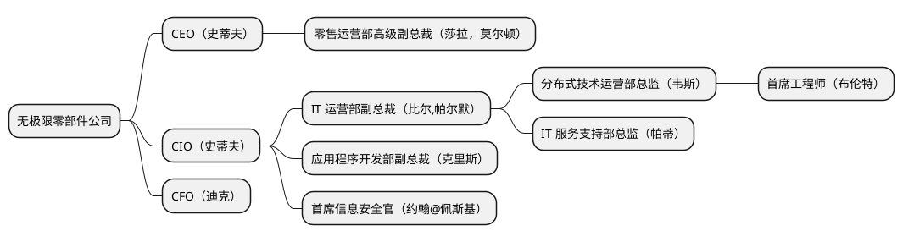
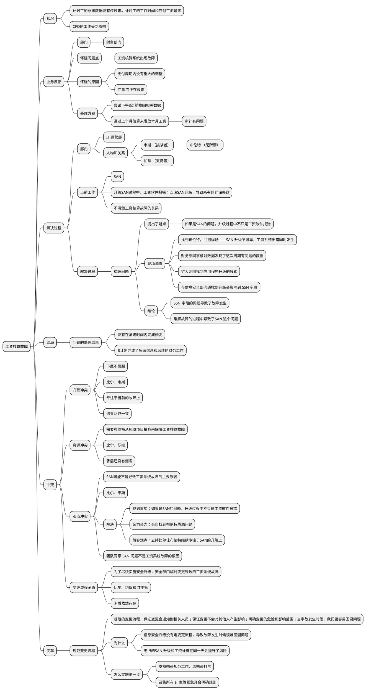
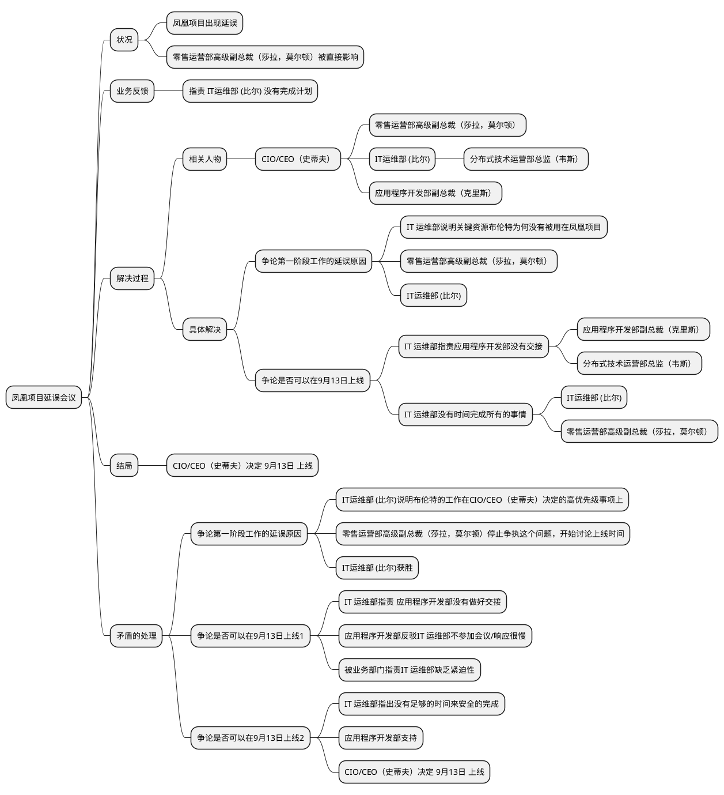
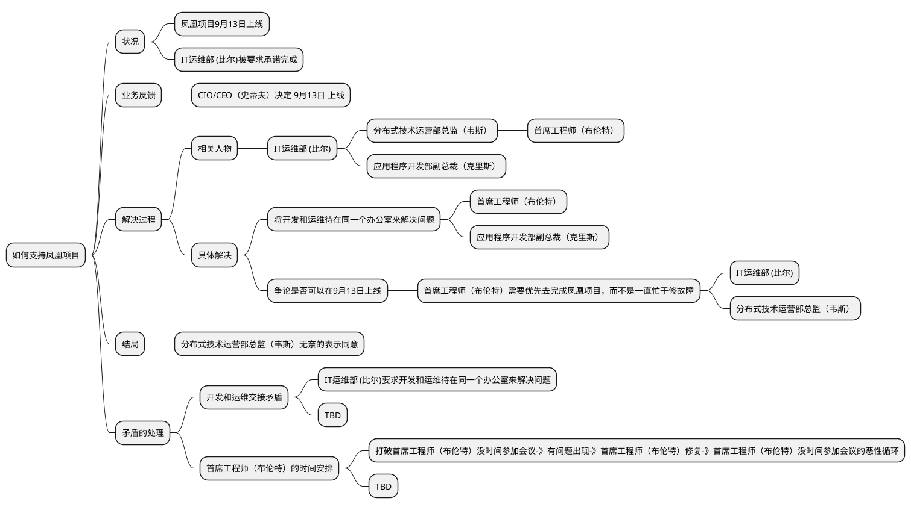
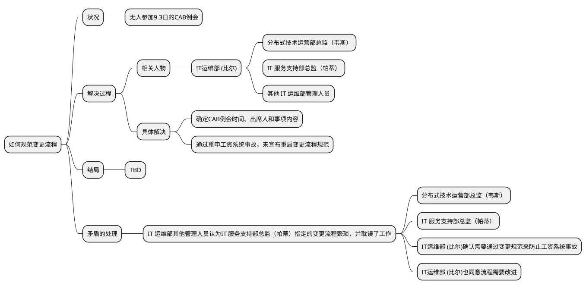

# 凤凰项目

----

## 人物关系图

```plantuml
@startmindmap 组织结构
* 无极限零部件公司
** CEO（史蒂夫）
*** 零售运营部高级副总裁（莎拉，莫尔顿）
** CIO（史蒂夫）
*** IT 运营部副总裁（比尔,帕尔默）
**** 分布式技术运营部总监（韦斯）
***** 首席工程师（布伦特）
**** IT 服务支持部总监（帕蒂）
*** 应用程序开发部副总裁（克里斯）
*** 首席信息安全官（约翰@佩斯基）
** CFO（迪克）
@endmindmap
```

## 9.2 
### 工资核算故障

```plantuml
@startmindmap 工资核算故障
* 工资核算故障
** 状况
*** 计时工的总账数据没有传过来。计时工的工作时间和应付工资是零
*** CFO的工作受到影响
** 业务反馈
*** 部门
**** 财务部门
*** 怀疑问题点
**** 工资核算系统出现故障
*** 怀疑的原因
**** 支付周期内没有重大的调整
**** IT 部门正在调查
*** 处理方案
**** 尝试下午3点前找回相关数据
**** 通过上个月估算来发放本月工资
***** 审计有问题
** 解决过程
*** 部门
**** IT 运营部
**** 人物和关系
***** 韦斯 （挑战者）
****** 布伦特 （无所谓）
***** 帕蒂 （支持者）
*** 当前工作
**** SAN
**** 升级SAN过程中，工资软件报错；回滚SAN升级，导致所有的存储失效
**** 不清楚工资核算故障的关系
*** 解决过程
**** 梳理问题
***** 提出了疑点
****** 如果是SAN的问题，升级过程中不只是工资软件报错
***** 现场调查
****** 找到布伦特，回溯现场——SAN 升级不可靠，工资系统出错同时发生
****** 财务部同事核对数据发现了这次周期有问题的数据
****** 扩大范围找到应用程序升级的线索
****** 与信息安全部沟通找到升级会影响到 SSN 字段
***** 结论
****** SSN 字段的问题导致了故障发生
****** 缓解故障的过程中导致了SAN 这个问题
** 结局
*** 问题的处理结果
**** 没有在承诺时间内完成修复
**** B计划导致了负面信息和后续的财务工作
** 冲突
*** 升职冲突
**** 下属不信服
**** 比尔、韦斯
**** 专注于当前的故障上
**** 结果达成一致
*** 资源冲突
**** 需要布伦特从凤凰项目抽身来解决工资核算故障
**** 比尔、莎拉
**** 矛盾还没有爆发
*** 观点冲突
**** SAN可能不是导致工资系统故障的主要原因
**** 比尔、韦斯
**** 解决
***** 找到事实：如果是SAN的问题，升级过程中不只是工资软件报错
***** 亲力亲为：亲自找到布伦特溯源问题
***** 兼容观点：支持比尔让布伦特继续专注于SAN的升级上
**** 团队同意 SAN 问题不是工资系统故障的根因
*** 变更流程矛盾
**** 为了尽快实施安全升级，安全部门临时变更导致的工资系统故障
**** 比尔、约翰和 IT主管
**** 矛盾依然存在

** 变革
*** 规范变更流程
**** 规范的变更流程，保证变更会通知到相关人员；保证变更不会对其他人产生影响；明确变更的危险和影响范围；当事故发生时候，我们更容易回溯问题
**** 为什么
***** 信息安全升级没有走变更流程，导致故障发生时候很难回溯问题
***** 老旧的SAN 升级和工资计算在同一天会提升了风险
**** 怎么实施第一步
***** 支持帕蒂规范工作，给帕蒂打气
***** 召集所有 IT 主管紧急开会明确规则
@endmindmap
```

### 9.3

```plantuml
@startmindmap 凤凰项目延误会议
* 凤凰项目延误会议
** 状况
*** 凤凰项目出现延误
*** 零售运营部高级副总裁（莎拉，莫尔顿）被直接影响
** 业务反馈
*** 指责 IT运维部 (比尔) 没有完成计划
** 解决过程
*** 相关人物
**** CIO/CEO（史蒂夫）
***** 零售运营部高级副总裁（莎拉，莫尔顿）
***** IT运维部 (比尔)
****** 分布式技术运营部总监（韦斯）
***** 应用程序开发部副总裁（克里斯）
*** 具体解决
**** 争论第一阶段工作的延误原因
***** IT 运维部说明关键资源布伦特为何没有被用在凤凰项目
***** 零售运营部高级副总裁（莎拉，莫尔顿）
***** IT运维部 (比尔)
**** 争论是否可以在9月13日上线
***** IT 运维部指责应用程序开发部没有交接
****** 应用程序开发部副总裁（克里斯）
****** 分布式技术运营部总监（韦斯）
***** IT 运维部没有时间完成所有的事情
****** IT运维部 (比尔)
****** 零售运营部高级副总裁（莎拉，莫尔顿）
** 结局
*** CIO/CEO（史蒂夫）决定 9月13日 上线
** 矛盾的处理
*** 争论第一阶段工作的延误原因
**** IT运维部 (比尔)说明布伦特的工作在CIO/CEO（史蒂夫）决定的高优先级事项上
**** 零售运营部高级副总裁（莎拉，莫尔顿）停止争执这个问题，开始讨论上线时间
**** IT运维部 (比尔)获胜
*** 争论是否可以在9月13日上线1
**** IT 运维部指责 应用程序开发部没有做好交接
**** 应用程序开发部反驳IT 运维部不参加会议/响应很慢
**** 被业务部门指责IT 运维部缺乏紧迫性
*** 争论是否可以在9月13日上线2
**** IT 运维部指出没有足够的时间来安全的完成
**** 应用程序开发部支持
****  CIO/CEO（史蒂夫）决定 9月13日 上线
@endmindmap
```

```plantuml
@startmindmap 如何支持凤凰项目
* 如何支持凤凰项目
** 状况
*** 凤凰项目9月13日上线
*** IT运维部 (比尔)被要求承诺完成
** 业务反馈
*** CIO/CEO（史蒂夫）决定 9月13日 上线
** 解决过程
*** 相关人物
**** IT运维部 (比尔)
***** 分布式技术运营部总监（韦斯）
****** 首席工程师（布伦特）
***** 应用程序开发部副总裁（克里斯）

*** 具体解决
**** 将开发和运维待在同一个办公室来解决问题
***** 首席工程师（布伦特）
***** 应用程序开发部副总裁（克里斯）
**** 争论是否可以在9月13日上线
***** 首席工程师（布伦特）需要优先去完成凤凰项目，而不是一直忙于修故障
****** IT运维部 (比尔)
****** 分布式技术运营部总监（韦斯）
** 结局
*** 分布式技术运营部总监（韦斯）无奈的表示同意
** 矛盾的处理
*** 开发和运维交接矛盾
**** IT运维部 (比尔)要求开发和运维待在同一个办公室来解决问题
**** TBD
*** 首席工程师（布伦特）的时间安排
**** 打破首席工程师（布伦特）没时间参加会议-》有问题出现-》首席工程师（布伦特）修复-》首席工程师（布伦特）没时间参加会议的恶性循环
**** TBD
@endmindmap
```

```plantuml
@startmindmap CAB例会
* 如何规范变更流程
** 状况
*** 无人参加9.3日的CAB例会
** 解决过程
*** 相关人物
**** IT运维部 (比尔)
***** 分布式技术运营部总监（韦斯）
***** IT 服务支持部总监（帕蒂）
***** 其他 IT 运维部管理人员

*** 具体解决
**** 确定CAB例会时间、出席人和事项内容
**** 通过重申工资系统事故，来宣布重启变更流程规范
** 结局
*** TBD
** 矛盾的处理
*** IT 运维部其他管理人员认为IT 服务支持部总监（帕蒂）指定的变更流程繁琐，并耽误了工作
**** 分布式技术运营部总监（韦斯）
**** IT 服务支持部总监（帕蒂）
**** IT运维部 (比尔)确认需要通过变更规范来防止工资系统事故
**** IT运维部 (比尔)也同意流程需要改进

@endmindmap
```